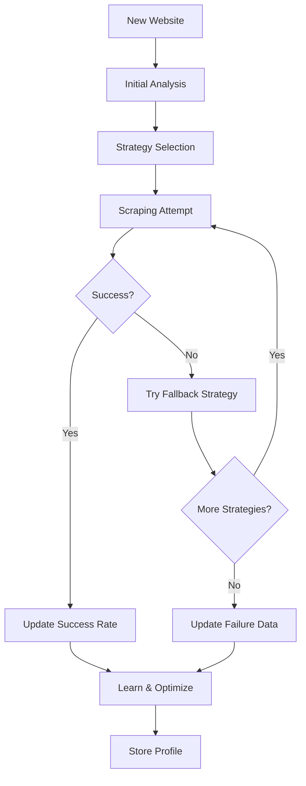

# ScrapperX - Advanced AI-Powered Website Scraper

ScrapperX is an intelligent web scraping platform that uses advanced techniques to extract content from websites, even those protected by anti-bot systems. It features adaptive learning, stealth mode, CAPTCHA solving, and comprehensive analytics.

## 🚀 Key Features

### Core Scraping Capabilities
- **Static HTML Scraping**: Fast extraction from simple websites
- **Dynamic JavaScript Rendering**: Full browser automation with Playwright
- **API Endpoint Discovery**: Automatic detection and extraction from REST APIs
- **Hybrid Approach**: Combines multiple methods for optimal results

### Advanced Anti-Bot Protection
- **🥷 Stealth Mode**: Advanced browser fingerprinting protection
- **🧠 Adaptive Learning**: AI learns optimal strategies for each website
- **🔐 CAPTCHA Solving**: Integration with 2captcha and AntiCaptcha services
- **⚡ Smart Retries**: Intelligent fallback strategies and rate limiting
- **🎭 Human Behavior Simulation**: Realistic mouse movements and scrolling
- **🔄 Session Management**: Cookie persistence and user agent rotation

### Intelligence & Analytics
- **📊 Success Rate Tracking**: Monitor performance across different websites
- **🎯 Website Profiling**: Automatic difficulty assessment and strategy optimization
- **📈 Performance Metrics**: Detailed timing and success analytics
- **🔍 Adaptive Strategy Selection**: Dynamic method selection based on website characteristics

## 🛠️ Technology Stack

### Backend
- **Node.js** with TypeScript
- **Express.js** for REST API
- **Playwright** for browser automation
- **MongoDB** for data persistence
- **Cheerio** for HTML parsing

### Frontend
- **Next.js 14** with TypeScript
- **Tailwind CSS** for styling
- **React Hooks** for state management

## 📦 Installation

### Prerequisites
- Node.js 18+ 
- MongoDB (local or cloud)
- Git

### Backend Setup

1. **Clone the repository**
```bash
git clone <repository-url>
cd ScrapperX/backend
```

2. **Install dependencies**
```bash
npm install
```

3. **Install Playwright browsers**
```bash
npx playwright install
```

4. **Environment Configuration**
Create a `.env` file in the backend directory:
```env
# Server Configuration
PORT=5000
NODE_ENV=development

# Database
MONGODB_URI=mongodb://localhost:27017/scrapperx

# JWT Secret
JWT_SECRET=your-super-secret-jwt-key-here

# OpenAI API (for AI features)
OPENAI_API_KEY=your-openai-api-key

# CAPTCHA Solving Services (Optional)
TWOCAPTCHA_API_KEY=your-2captcha-api-key
ANTICAPTCHA_API_KEY=your-anticaptcha-api-key

# Rate Limiting
RATE_LIMIT_WINDOW_MS=900000
RATE_LIMIT_MAX_REQUESTS=100
```

5. **Start the backend server**
```bash
npm run dev
```

### Frontend Setup

1. **Navigate to frontend directory**
```bash
cd ../frontend
```

2. **Install dependencies**
```bash
npm install
```

3. **Environment Configuration**
Create a `.env.local` file in the frontend directory:
```env
NEXT_PUBLIC_API_URL=http://localhost:5000
```

4. **Start the frontend development server**
```bash
npm run dev
```

## 🎯 Usage Guide

### Basic Scraping

1. **Enter URL**: Input the website URL you want to scrape
2. **Check robots.txt** (Optional): Verify scraping permissions
3. **Configure Options**: Set advanced options if needed
4. **Scrape**: Click the scrape button to extract content
5. **Export Results**: Download results in JSON or TXT format

### Advanced Configuration

#### Scraping Methods
- **Auto-detect** (Recommended): Intelligently selects the best method
- **Static HTML**: Fast extraction for simple websites
- **Dynamic (JavaScript)**: Full browser rendering for SPAs
- **Stealth Mode**: Advanced anti-bot protection bypass
- **Adaptive Learning**: AI-powered strategy optimization

#### Stealth Options
- **Basic**: Standard anti-detection measures
- **Advanced**: Enhanced fingerprinting protection
- **Maximum**: Full stealth mode with human behavior simulation

#### CAPTCHA Handling
- **Skip**: Ignore CAPTCHA challenges
- **Manual**: Wait for manual solving
- **2captcha**: Automatic solving via 2captcha service
- **AntiCaptcha**: Automatic solving via AntiCaptcha service

### Analytics Dashboard

Access the analytics dashboard to:
- Monitor success rates across different websites
- View website difficulty profiles
- Track performance metrics
- Manage adaptive learning profiles
- Export/import configuration data

## 🔧 API Reference

### Core Endpoints

#### Scrape Website
```http
POST /api/scraper/scrape
Content-Type: application/json

{
  "url": "https://example.com",
  "options": {
    "forceMethod": "adaptive",
    "enableStealthScraping": true,
    "enableAdaptiveScraping": true,
    "captchaSolver": "2captcha",
    "captchaApiKey": "your-api-key",
    "stealthLevel": "advanced",
    "timeout": 60000,
    "maxRetries": 3,
    "learningMode": true
  }
}
```

#### Check robots.txt
```http
POST /api/scraper/check-robots
Content-Type: application/json

{
  "url": "https://example.com",
  "userAgent": "ScrapperX-Bot"
}
```

### Analytics Endpoints

#### Get Success Rates
```http
GET /api/scraper/adaptive/success-rates
```

#### Get Website Profile
```http
GET /api/scraper/adaptive/stats?domain=example.com
```

#### Clear Website Profile
```http
DELETE /api/scraper/adaptive/profile/example.com
```

#### Export Profiles
```http
GET /api/scraper/adaptive/export
```

#### Import Profiles
```http
POST /api/scraper/adaptive/import
Content-Type: application/json

{
  "profiles": "json-string-of-profiles"
}
```

## 🧠 How It Works

### Intelligent Strategy Selection

1. **Website Analysis**: Analyzes the target website for characteristics
2. **Historical Data**: Checks previous scraping attempts and success rates
3. **Strategy Selection**: Chooses optimal method based on analysis
4. **Execution**: Performs scraping with selected strategy
5. **Learning**: Updates success rates and website profile

### Adaptive Learning Process



### Stealth Mode Features

- **Browser Fingerprinting Protection**: Randomizes browser characteristics
- **User Agent Rotation**: Uses realistic, rotating user agents
- **Human Behavior Simulation**: Mimics human interaction patterns
- **Anti-Detection Measures**: Bypasses common bot detection methods
- **Session Management**: Maintains cookies and session state
- **Rate Limiting**: Intelligent request pacing

## 📊 Performance Optimization

### Best Practices

1. **Use Adaptive Mode**: Let the AI learn optimal strategies
2. **Enable Learning Mode**: Improve performance over time
3. **Configure Timeouts**: Set appropriate timeouts for your use case
4. **Monitor Analytics**: Track success rates and optimize
5. **Respect Rate Limits**: Use appropriate delays between requests

### Troubleshooting

#### Common Issues

**High Failure Rate**
- Enable stealth mode
- Increase timeout values
- Check for CAPTCHA challenges
- Verify website accessibility

**CAPTCHA Challenges**
- Configure CAPTCHA solving service
- Use manual solving for testing
- Check API key configuration

**Rate Limiting**
- Increase delays between requests
- Use session persistence
- Monitor rate limit indicators

## 🔒 Security & Ethics

### Responsible Scraping

- **Respect robots.txt**: Check and follow robots.txt guidelines
- **Rate Limiting**: Don't overwhelm target servers
- **Terms of Service**: Respect website terms and conditions
- **Data Privacy**: Handle scraped data responsibly
- **Legal Compliance**: Ensure compliance with applicable laws

### Security Features

- **Input Validation**: All inputs are validated and sanitized
- **Rate Limiting**: Built-in protection against abuse
- **Error Handling**: Comprehensive error handling and logging
- **Data Encryption**: Sensitive data is encrypted in transit

## 🤝 Contributing

We welcome contributions! Please see our [Contributing Guide](CONTRIBUTING.md) for details.

### Development Setup

1. Fork the repository
2. Create a feature branch
3. Make your changes
4. Add tests if applicable
5. Submit a pull request

## 📄 License

This project is licensed under the MIT License - see the [LICENSE](LICENSE) file for details.

## 🆘 Support

- **Documentation**: Check this README and inline code comments
- **Issues**: Report bugs and request features via GitHub Issues
- **Discussions**: Join community discussions in GitHub Discussions

## 🚧 Roadmap

### Upcoming Features

- [ ] Proxy rotation support
- [ ] Custom JavaScript injection
- [ ] Scheduled scraping
- [ ] Webhook notifications
- [ ] Advanced data transformation
- [ ] Multi-language support
- [ ] Docker containerization
- [ ] Cloud deployment guides

### Version History

- **v2.0.0** - Advanced AI-powered scraping with stealth mode and adaptive learning
- **v1.0.0** - Initial release with basic scraping capabilities

---

**Disclaimer**: This tool is for educational and legitimate research purposes. Users are responsible for ensuring compliance with website terms of service and applicable laws. Always obtain proper authorization before scraping websites. 